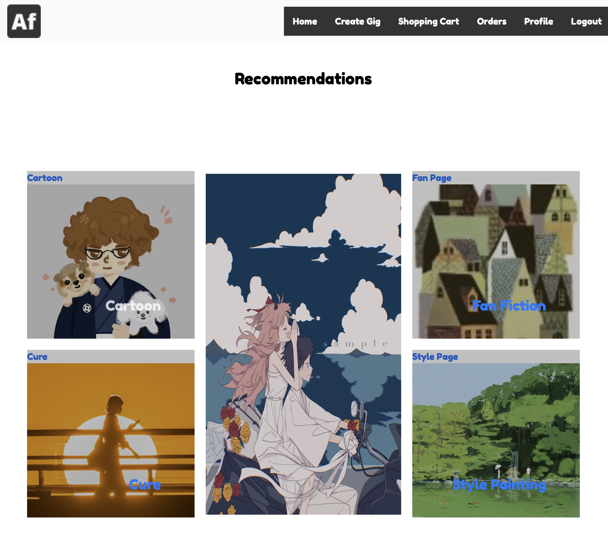
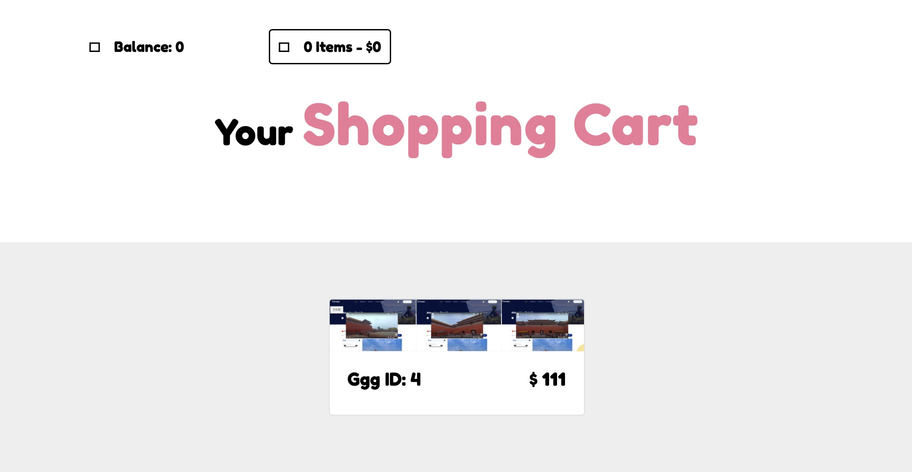

# ArtFinder

# Design

This is a site designed for artists and buyers who want to request work, users can be both buyers and sellers

## Use Case 

1. [Register and Log in]()
2. [Non-logged in users browse the main page and category pages]()
3. [Browsing Personal Information]()
4. [Modify profile picture, recharge, post and view your most recent gig]()
5. [Browse the four different categories and see gig details]()
6. [Order gig, add to cart and consolidated settlement gig]()
7. [View orders in progress and orders that have been completed]()
8. [Look at what has been bought and what has been sold, as the seller can close an order, that is, the painting has been completed]()
9. [The main page automatically recommends paintings based on algorithms]()
10. [The main page adjusts the light theme]()
11. [Mobile phone tablet adaptation]()
12. [Database emptying function]()

Example of the pages:

!
